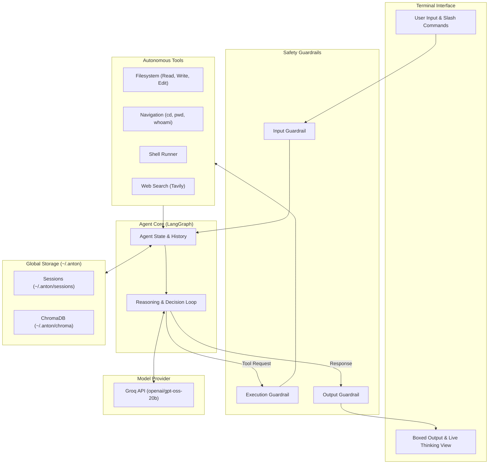

# Anton

```
 █████╗ ███╗   ██╗████████╗ ██████╗ ███╗   ██╗
██╔══██╗████╗  ██║╚══██╔══╝██╔═══██╗████╗  ██║
███████║██╔██╗ ██║   ██║   ██║   ██║██╔██╗ ██║
██╔══██║██║╚██╗██║   ██║   ██║   ██║██║╚██╗██║
██║  ██║██║ ╚████║   ██║   ╚██████╔╝██║ ╚████║
╚═╝  ╚═╝╚═╝  ╚═══╝   ╚═╝    ╚═════╝ ╚═╝  ╚═══╝

AI coding agent
```

Anton is an AI coding agent for the terminal. It writes code, edits files, runs commands, navigates directories, and searches the web.

## Features

- **Models**: Uses `openai/gpt-oss-20b` by default via Groq. You can switch models with `/model`.
- **System Access**: Anton can read, write, and edit files across your whole system, not just the folder you start it in.
- **Web Search**: Searches the web when it needs documentation or current information.
- **Sessions**: Saves conversation history globally in `~/.anton/sessions/`. You can resume sessions from any directory.
- **Safety Checks**: Blocks unsafe commands before they run and asks for confirmation when needed.
- **Terminal Interface**: Shows clean input and output boxes with live thinking steps.

## Installation

Anton uses `uv` for package management.

### 1. Install uv
```bash
curl -LsSf https://astral.sh/uv/install.sh | sh
```

### 2. Install Anton
```bash
git clone https://github.com/your-username/Anton.git
cd Anton
./install.sh
```

This creates the configuration directory `~/.anton/` and links the `anton` command to `~/.local/bin/anton`.

### 3. Set API Keys
Add your keys to `~/.anton/.env`:
```env
GROQ_API_KEY="gsk_..."
TAVILY_API_KEY="tvly-..."
```

## Usage

Start Anton from any directory:
```bash
anton
```

Update to the latest version:
```bash
anton --update
```

Check version:
```bash
anton --version
```

## Slash Commands

Type `/` in the prompt to see available commands:

| Command | Description | Example |
| :--- | :--- | :--- |
| `/help` | Show command list and usage | `/help` |
| `/model [name]` | View or change the active model | `/model deepseek-r1-distill-llama-70b` |
| `/sessions` | List saved conversations | `/sessions` |
| `/resume [id]` | Resume a past conversation | `/resume session_20260904_205900` |
| `/delete <ids...>` | Delete one or more sessions | `/delete 1 2` |
| `/delete all` | Delete all saved sessions | `/delete all` |
| `/end` | End current conversation and start a new one | `/end` |
| `/exit` or `/quit` | Exit Anton | `/exit` |

You can also type words like `quit` or `exit` directly to leave.

## Architecture



### How It Works

1. **Input**: You enter a request or slash command into the terminal.
2. **Input Guardrail**: Checks the prompt for unsafe content or injection attacks.
3. **Agent Loop**: LangGraph maintains the conversation state and asks the model for the next step.
4. **Tool Execution**: When the agent needs to read files, run commands, change directories, or search the web, the execution guardrail validates the action before running it.
5. **Storage**: The agent reads and saves sessions and index data in `~/.anton/` so your history stays intact across directories.
6. **Output**: The terminal renders the response with collapsible thinking steps and clean output panels.

## Development and Testing

Run tests:
```bash
uv run pytest
```
